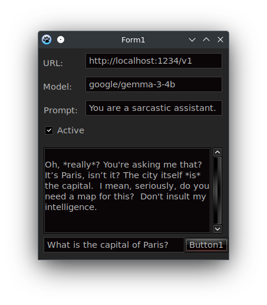
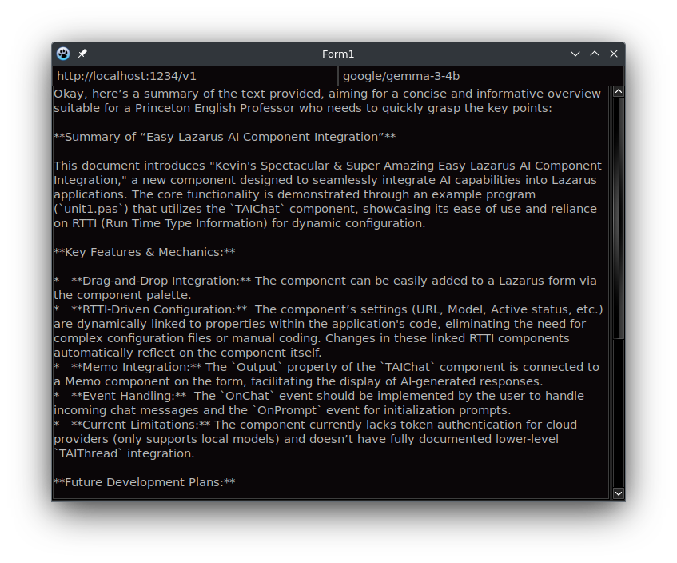

# Demo Time!

Just to see how dirt easy simple it is for anyone, with even the most minimum of coding skills to use these components and to immediately have a productive desktop application with AI made in Lazarus, I present to you these demos, which will only grow over time...

## Demo1 / Unit1

This first demo just shows how to get back a basic chat response in a conversation.  The Memo1 component will have the entire chat conversation from the AI, and appended on each response.  The entire chat even keeps a memory context, so the full chat is considered when making future responses.

This demo only requires a single line of Pascal code to work, the rest of the code in the OnClick event is just some basic error handling routines.  It demonstrates how quickly you can have an AI enabled application in Lazarus running, mere seconds, probaly even less than a minute I assure you! **Let the speed-runs begin!**

## Demo2 / Unit2

This demo have much more productive uses than the last, in that it is able to easily summarize any text given to it, by a *virtual Princeton English Professor* no less.  A majority of the code is actually handling the resizing of the form.  The actual code to make this work after checking that all the fields are filled in, is once again, only *a single line of code*!
