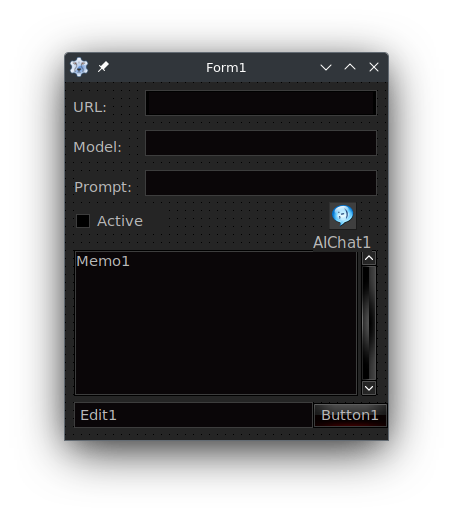
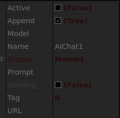

# Easy Lazarus AI Component Integration

Looking for a super easy almost literally drag-and-drop solution to add AI into your Lazarus applications?  Then look no further than *Kevin's spectacular, and super amazing **Easy Lazarus AI Component Integration** AI components!*.  To understand just how dead simple the integration is, let's look at an example program, which can be [located in the repo](Demos/unit1.pas) as well.

```pascal
unit Unit1;

{$mode objfpc}{$H+}

interface

uses
  Classes, SysUtils, Forms, Controls, Graphics, Dialogs, StdCtrls, RTTICtrls,
  AIChat;

type

  { TForm1 }

  TForm1 = class(TForm)
    AIChat1: TAIChat;
    Button1: TButton;
    Edit1: TEdit;
    Label1: TLabel;
    Label2: TLabel;
    Label3: TLabel;
    Memo1: TMemo;
    TICheckBox1: TTICheckBox;
    TIEdit1: TTIEdit;
    TIEdit2: TTIEdit;
    TIEdit3: TTIEdit;
    procedure AIChat1Chat(Sender: TObject; const AResponse: string;
      Success: Boolean);
    procedure Button1Click(Sender: TObject);
  private

  public

  end;

var
  Form1: TForm1;

implementation

{$R *.lfm}

{ TForm1 }

procedure TForm1.Button1Click(Sender: TObject);
begin
  if not AIChat1.Active then
    raise Exception.Create('Please Activate before sending a message.');
  Button1.Enabled:=False;
  AIChat1.SendMessage(Edit1.Text); // Non-blocking...
end;

procedure TForm1.AIChat1Chat(Sender: TObject; const AResponse: string;
  Success: Boolean);
begin
  Button1.Enabled:=True;
end;

end.
```

Here is a screenshot of the component placed onto the form inside the [LFM](Demos/unit1.lfm):



Rather than opening or reading the LFM file directly, I'll explain how all these components are connected to make that example above there only need a single callback, which is the button...

  * Each of those configuration Text Fields are actually what are called [RunTime TypeInfo](https://wiki.freepascal.org/RTTI_controls) control fields, which are connected directly to the properties of other components within your application.
    - URL is connected to `AIChat1.URL`, Model to `AIChat1.Model`, and so on.
    - If the value in these linked **RTTI** components is altered, it syncs it with the linked component.
    - If data in the component is changed, the linked element is also updated to reflect that.
    - This makes RTTI quite powerful in components in Lazarus, so no code to allow the user to customize.
    - The **Active** checkbox is connected to the `AIChat1.Active`, which does what you can imagine.
  * The `AIChat1` component's `.Output` property is pointed to the `Memo1` component via the Lazarus property window.
  * The `Button1` on the form has the event `OnClick` attached with the code shown above.
  * User presses `Button1`, and it will send the contents of `Edit1` to the component via `AIChat1.SendMessage`.

It's really that easy to build a very basic AI chat application.  This application also has full context memory, which can be accessed via additional properties.  There is still a lot of work to be done to make this into a better component, like for example, it does not yet include any sort of token authentication, and so it cannot yet be used with any cloud provider, only with local models for now.  This feature will be added in a future version.  Tool support has started, but may take on a completely different form, as I have some ideas on how to make it work even better for the case of applications like this.

Here's the basic documentation on how to use the component, but not yet the lower level `TAIThread`, documentation for that will come at a later date.  This release is focusing primarily on the Lazarus component, and just how amazing and spectacular it is.

### TAIChat

Add the `klibai`, and `klibailaz` into your Lazarus IDE, and rebuild.  You should see a new tab in your component palette called **AI**, inside there is currently a single component called `TAIChat`.  You can click this and place it onto your Lazarus form as you would any other component.  This component will only work with GUI applications, do not use it for server-side of command-line programs with a `TDataModule`, use the soon to be documented `TAIThread` instead for those purposes.

Once you have placed it onto your form, here is what you can configure via the *Lazarus Property Window*:



  * **Active**:  Used to have the AI ready at application start time.
  * **Append**:  Should the data placed into the Output Memo component be appended?
  * **Model**:   The mode, should be one of the available models available from *URL*.
  * **Output**:  Points a Memo component in the form which the component can send the chat response to.
    - Not required, but if this is not selected, then you should at least set the `OnChat` event.
  * **Prompt**:  The system prompt to use.
    - If left blank, it will first try to call the `OnPrompt` event, if that failes it will use a sane default.
  * **Sending**: Read-only, can be used for status, if set, it means that the AIChat is working on something.
  * **URL**:     The OpenAI API endpoint which you want to connect to.
    - Currently no support for authentication, so cannot connect to commercial cloud providers.

There are two events currently on this component which can be set:

  * **OnChat**:   Sends the callback once a chat response has been received.
    - Always set this over placing your code underneith the `.SendMessage` call.
  * **OnPrompt**: Called once during the initialization of the AI component, called when `.Active` gets set to *True*.
    - Is not called otherwise during runtime, and so cannot be used to dynamically alter the system prompt.
    - For the AI to remain properly consistent, the system prompt needs to be set once at the beginning and be persistent.

There are some properties which can only be accessed programmatically and aren't exposed as properties in Lazarus:

  * **MessageReady**: Boolean state variable, changes to *True* once a chat response is received and ready.
  * **Message**: After the above boolean is set to *True*, the actual message can be obtained from reading this string.
  * **ChatHistory**: Can be used to generate a full chat transcript of this AIChat, can be used to populate a Memo or saved.

These are the methods which are exposed, one currently:

  * **SendMessage(msg: string);**: This is used in a very obvious way...  Do I even need to explain what this does?
    - I will however note that this does not return until after a chat response has been received.
    - However, it will not block the UI, so buttons and other form elements can be updated and used.
    - This functionality may change in a future version, so always use the `OnChat` event over placing handler code after this method call.

## Future Improvements

I want to change how `TAIChat.SendMessage` works, so that there are a few options available to the application developer, such as using an existing `TTimer` component on the form to perform a poll on the thread, or to disable any automatic polling, and to instead delegate it entirely to the application developer, where they need to manually check for when a message is ready.  I am still deciding the exact implementation details, but I want it to be as flexible as possible, so that this component won't be bound to the LCL, and could be used in server and command-line applications via the `TDataModule`.

And finally, I'll leave you with this, a screenshot of the demo1 application running:


